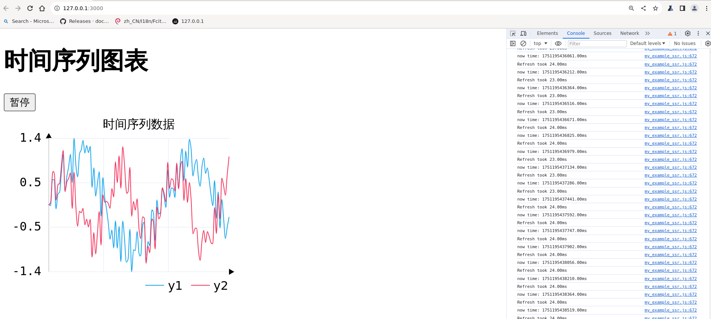

# realtime plot

## fun
An example showcasing how to use Chartistry with Leptos and SSR. It borrows heavily from [Leptos' SSR mode axum example](https://github.com/leptos-rs/leptos/tree/main/examples/ssr_modes_axum).
more info and start demo ,please check "leptos" and "leptos-chartistry". 
## run
Run `cargo-leptos watch` (note the '-').
## out
frame:30 fps


## plot
## NOTE:
we can use websocket client to refresh data and plot in real time.

### client
websocket client  refresh data 
```sh
cargo leptos watch
```
### python server
```sh
uv run 
src/server.py
```
### rust axum websocket server
```sh
cargo run --example server
```


